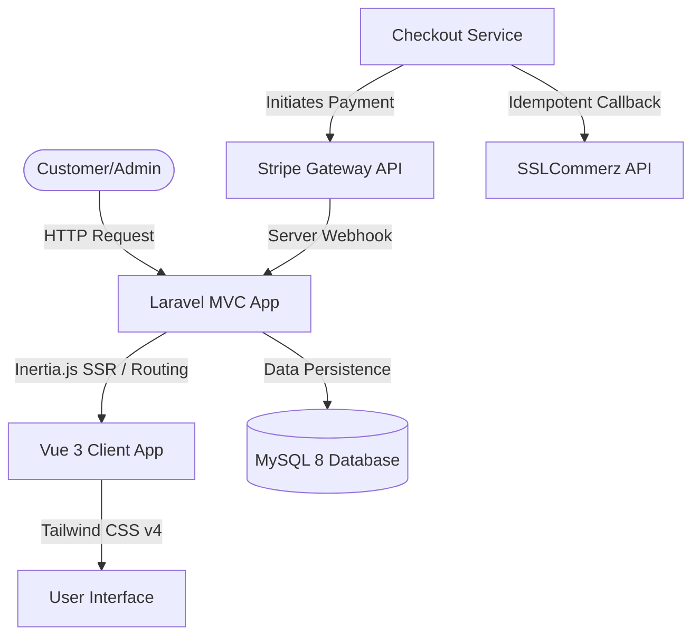
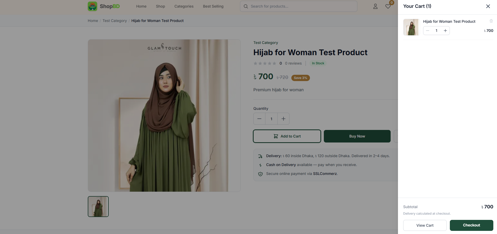
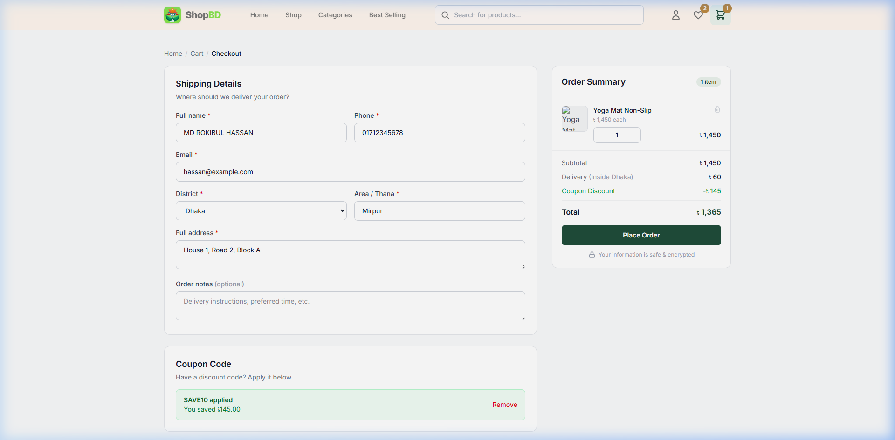
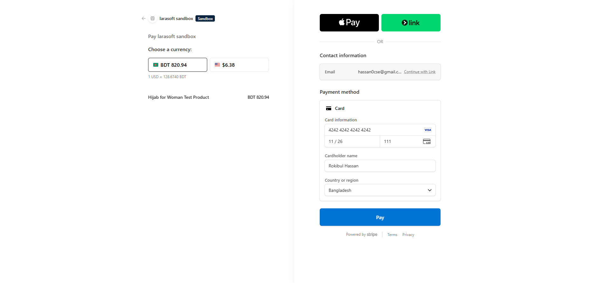
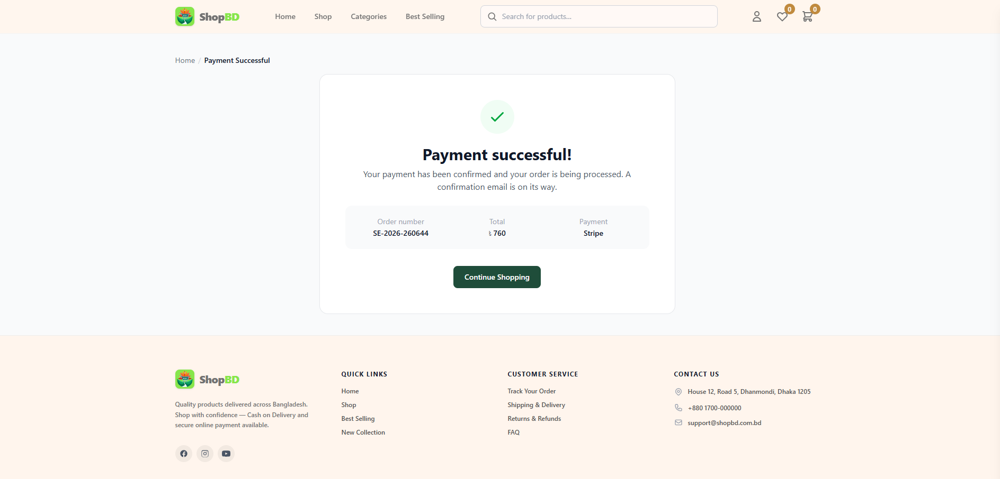
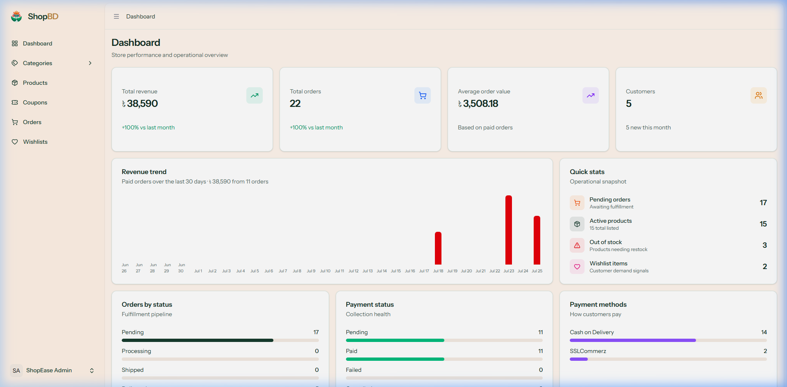

# ShopBD (ShopEase) — Laravel E-commerce Platform

A modern, full-featured e-commerce platform built with a high-performance stack combining Laravel, Vue 3, Inertia.js, and Tailwind CSS. 

- **GitHub Repository**: [hassanroki/b9-ecom-shop-vue](https://github.com/hassanroki/b9-ecom-shop-vue)
- **Live Tech Stack**: Laravel 13 · Inertia.js · Vue 3 (Composition API) · TypeScript · Tailwind CSS v4 · MySQL 8

---

## 📖 Table of Contents
1. [Key Features](#-key-features)
2. [Project Architecture](#-project-architecture)
3. [Setup & Installation](#%EF%B8%8F-setup--installation)
4. [UI & UX Overview](#-ui--ux-overview)
5. [Stripe Integration Details](#-stripe-integration-details)
6. [Coupon System & Schema](#-coupon-system--schema)
7. [Screenshots & User Flows](#-screenshots--user-flows)

---

## 🌟 Key Features
- **Interactive Storefront**: Rich, responsive catalog browsing, dynamic search suggestions, and carousel slides.
- **Persistent Cart**: Unified cart state with real-time updates and guest cart storage.
- **Checkout Flows**: Multi-channel checkout supporting **Cash on Delivery (COD)**, **SSLCommerz**, and **Stripe**.
- **Coupon Discount System**: Highly configurable coupon codes supporting fixed amounts and percentage discounts with minimum spend constraints and usage limit control.
- **Admin Dashboard**: Elegant statistical widgets, sales metrics breakdown, top-selling items, and a dynamic daily revenue trend chart.
- **Customer Dashboard**: Secure area for order history tracking, status monitoring, and profile detail edits.

---

## 🛠️ Project Architecture



---

## ⚙️ Setup & Installation

Follow these steps to run the application locally:

### 1. Prerequisite Checklist
- **PHP**: `>= 8.2` (PHP 8.3 CLI recommended)
- **Node.js**: `>= 20` (v26 recommended)
- **Composer**: Latest Stable Version
- **Database**: MySQL 8+ with local server running on port `3306`

### 2. Installation Steps
Clone and navigate to the project directory:
```bash
git clone https://github.com/hassanroki/b9-ecom-shop-vue.git
cd b9-ecom-shop-vue
```

Install backend PHP dependencies:
```bash
composer install
```

Install frontend Node packages:
```bash
npm install
```

### 3. Environment Configuration
Create a copy of `.env.example`:
```bash
cp .env.example .env
```

Open `.env` and configure your database and third-party credentials:
```env
DB_CONNECTION=mysql
DB_HOST=127.0.0.1
DB_PORT=3306
DB_DATABASE=b9_ecom_shop_vue
DB_USERNAME=root
DB_PASSWORD=

# SSLCommerz Settings
SSLC_SANDBOX=true
SSLC_STORE_ID=tasku6a5766d3d7f27
SSLC_STORE_PASSWORD=tasku6a5766d3d7f27@ssl
SSLC_STORE_CURRENCY=BDT

# Stripe Settings
STRIPE_KEY=pk_test_51TuRBuAXk7zfv0BDYkJ5n5y0gZaHwhMRRsDQkRrRsJ8YjIIckuWwgJVjo9wJopklDbtnw05cR4dX3pfeKTmbu9f7001EJro35c
STRIPE_SECRET=sk_test_51TuRBuAXk7zfv0BDpKt9IyUe9VGWVtCHeaUNENI12oDYghOfzvXUaFOMUApFDEoGsYSDpeQr21P2jOAPl1UPtYWo00kptN4UlK
STRIPE_WEBHOOK_SECRET=
STRIPE_CURRENCY=USD
```

Generate the Laravel application key:
```bash
php artisan key:generate
```

### 4. Database Setup & Seeding
Run structural migrations and populate tables with demo data (admin profiles, dummy products, slides):
```bash
php artisan migrate --seed
```

Generate a public symbolic link for media assets:
```bash
php artisan storage:link
```

### 5. Running the Application
Launch the Vite hot-reloading compilation server:
```bash
npm run dev
```

In a new terminal window, serve the Laravel application:
```bash
php artisan serve --port=8081
```
Open **`http://localhost:8081`** in your browser.

# Cach Clear Command
php artisan optimize:clear

---

## 🎨 UI & UX Overview

### Admin Panel
- **Analytics Dashboard**: Aggregated summary cards showing total revenue, order metrics, AOV, and customer registration stats.
- **Dynamic Revenue Trend Chart**: Renders daily revenue aggregates for the past 30 days. Resolved wrapper height limits to ensure exact pixel-by-pixel rendering across responsive viewports.
- **Split Breakdown Cards**: High-visibility progress bars classifying orders by fulfillment status, payment method, and collection health.
- **Quick Statistics**: Highlighting pending orders, inventory stockouts, and active listing statuses.

### Storefront
- **Visual Grid**: Categorized filters, best seller lists, and dynamic product showcase cards.
- **Side Cart Drawer**: Prompts instantaneous subtotal calculations on adding or editing quantity of cart items.
- **Order Invoicing**: Post-payment success summaries showing items ordered, district-specific delivery charges, applied discount details, and dynamic order IDs.

---

## 💳 Stripe Integration Details

ShopBD supports full-featured credit card transactions using Stripe's hosted checkout sessions.

```
                  ┌──────────────────────┐
                  │ Order Placed (Cart)  │
                  └──────────┬───────────┘
                             │
                             ▼
              ┌──────────────────────────────┐
              │ StripePaymentService:        │
              │  1. Converts BDT -> USD      │   
              │  2. Creates Checkout Session │
              └──────────┬───────────────────┘
                         │
                         ▼
             ┌────────────────────────┐
             │ Redirect to Stripe.com │
             └──────────┬─────────────┘
                        │
         ┌──────────────┴──────────────┐
  [Success]                        [Cancel]
         │                             │
         ▼                             ▼
┌─────────────────┐           ┌─────────────────┐
│ Success URL      │           │ Cancel URL      │
│ Confirm session  │           │ Cancel payment  │
│ Order: PAID     │           │ Payment: CANCEL │
└─────────────────┘           └─────────────────┘
```

### Conversion Logic
Since Stripe sandbox mode transactions represent value in ISO 4217 currencies (e.g. `USD`), the application automatically translates Bangladeshi Taka (`BDT`) into `USD` using a conversion exchange rate config:
- `STRIPE_EXCHANGE_RATE` configured in `.env` (default is `0.0084`).
- Decimal values are safely rounded and converted into cents (smallest currency unit) before passing properties to the Stripe API.

### Webhook Event Listeners
Webhook callbacks verify signatures and update order records asynchronously (e.g., if a user closes their tab mid-checkout):
- **`checkout.session.completed`**: Retreives order references from session metadata, marks the `Payment` transaction record status to `success`, and flags the main `Order` row as `paid`.
- **`checkout.session.expired`**: Sets associated transactional records to `cancelled`.

### Test Card Credentials
For testing checkout flows in developers Sandbox mode, input:
- **Card Number**: `4242 4242 4242 4242`
- **Expiration Date**: Any date in the future (e.g., `12 / 29`)
- **CVC**: `123`
- **Zip / Postcode**: Any standard code (e.g., `10001` or `1216`)

---

## 🎫 Coupon System & Schema

The checkout page features a flexible coupon code validation and application system.

```
                    ┌─────────────────────────┐
                    │  Customer Types Code    │
                    └────────────┬────────────┘
                                 │
                                 ▼
                     ┌───────────────────────┐
                     │ Coupon Controller:    │
                     │  - Uppercased Code    │
                     │  - Validates Dates    │
                     │  - Validates Minimums │
                     └───────────┬───────────┘
                                 │
                                 ▼
                    ┌────────────────────────┐
                    │ Apply discount sub-tot │
                    └────────────────────────┘
```

### Database Schema
The database hosts a dedicated `coupons` table mapping operational rules:
- **Type**: `fixed` (flat BDT deduction) or `percentage` (rates based discount).
- **Minimum Amount**: The minimum cart subtotal required to use the coupon (e.g., `৳50`).
- **Maximum Discount**: Upper limit cap on percentage-based discounts (e.g., maximum discount `৳500`).
- **Usage Limits**: Controls the maximum overall times a coupon can be redeemed (`usage_limit`) alongside how many times a single customer can apply it (`usage_per_user`).
- **Date Bounds**: `starts_at` and `expires_at` specify the periods of coupon validity.

### Application Logic
When an order with an active coupon is finalized, the system records:
1. `coupon_id`: Soft-linked reference to the DB coupon entity.
2. `coupon_code`: Snapshot code stored in the order table (retains context if coupon table rules change).
3. `discount_amount`: The computed total discount applied (deducted from subtotal at checkout).

---

## 📸 Screenshots & User Flows

Detailed visual walkthrough of the storefront checkout and admin procedures:

### 1. Storefront Home Page
An overview of the home portal showcasing carousel promo elements, products grids, and navigation indicators.


### 2. Slide-out Cart Drawer
Real-time preview of added merchandise details, individual units count, and subtotal calculation directly in the drawer.


### 3. Coupon Application (Checkout Page)
Demonstrating validation feedback on applying the `SAVE10` discount coupon:


### 4. Stripe Checkout Redirection
Secure external redirect page showing the converted amount details and test card form:


### 5. Invoice & Payment Success Page
The confirmation template loaded after successful transaction completion:


### 6. Admin Analytics Dashboard
Back-office monitoring dashboard displaying overall totals and the daily revenue trend bar chart showing newly updated metrics.

